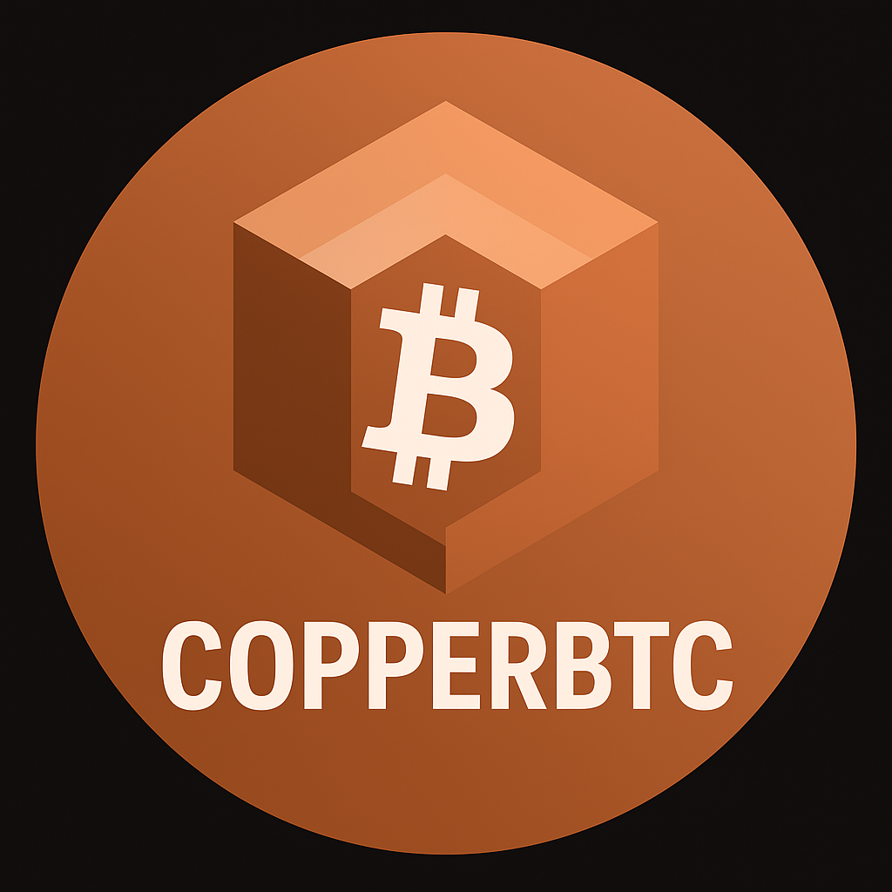
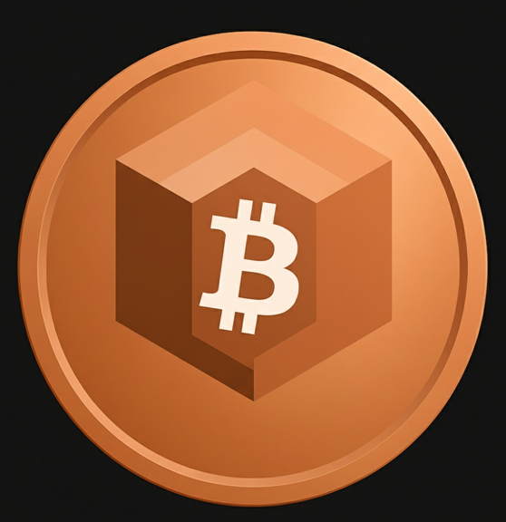

# 🧱 CopperBTC — “Make Money Matter Again.”
A proof-of-metal experiment bridging real-world copper assets to on-chain value through verifiable receipts, attestations, and a BTC-denominated ERC-20 token on Base.

  
    
  

## 🪙 Overview
**CopperBTC** is a physically-backed, Bitcoin-denominated token deployed on the **Base** network (chain ID 8453).  
Each token represents a verifiable link between a **real-world copper asset** and on-chain attestations proving its authenticity, weight, and ownership.

This repository contains the public landing page and documentation for the **Phase‑0** prototype.

## ⚙️ Architecture
CopperBTC’s on-chain ecosystem includes:

| Contract | Purpose | Address |
|-----------|--------|---------|
| **CopperReceiptNFT** | ERC‑721 receipt that encodes the copper lot’s metadata (weight, purity, serial, IPFS URI). | [`0xcE806BdFe7d45BDBC40244a2069927616574546B`](https://basescan.org/address/0xcE806BdFe7d45BDBC40244a2069927616574546B) |
| **AttestationRegistry** | Records IPFS proof CIDs, attestors, and timestamps verifying physical authenticity. | [`0x2DAF8C11c64a9b5A998Fc757ee11a209Ea25743d`](https://basescan.org/address/0x2DAF8C11c64a9b5A998Fc757ee11a209Ea25743d) |
| **CopperBTC (ERC‑20)** | Zero‑decimal token (1 = 1 satoshi equivalent) minted only after a valid attestation exists. | [`0xF841ee6CD34f25636832970640530f509dB00Ac3`](https://basescan.org/address/0xF841ee6CD34f25636832970640530f509dB00Ac3) |

## 🧾 Proof Chain
Each minted CopperBTC token is backed by a transparent, reproducible trail of evidence:

1. **Physical Purchase** — 1‑lb .9999 copper cube acquired via BTC payment.  
2. **Receipt & Evidence** — Documents, photos, and hashes stored in an **IPFS dossier**:  
   - 📜 [`receipt.json` (IPFS)](https://gateway.pinata.cloud/ipfs/bafybeifuza7p3wkid3zvzc4ltcvgs54eonlfou36c4hd2x5mka23ck6dxq/receipt.json)  
3. **NFT Minting** — On‑chain ERC‑721 receipt references that dossier.  
4. **Attestation** — Authorized wallet signs and timestamps the IPFS CID.  
5. **Tokenization** — CopperBTC minted to owner wallet once proof is attested.

Together, these steps create a verifiable **proof‑of‑metal trail** that ties a physical object to its digital twin — immutable, transparent, and open for inspection.

## 🪙 Token Metadata
| Field | Value |
|-------|------|
| **Name** | Copper‑Backed BTC |
| **Symbol** | COPPERBTC |
| **Decimals** | 0 |
| **Chain** | Base Mainnet (8453) |
| **Contract** | [`0xF841ee6CD34f25636832970640530f509dB00Ac3`](https://basescan.org/address/0xF841ee6CD34f25636832970640530f509dB00Ac3) |
| **Image** | `ipfs://bafybeihq7ziy57rpahotoqmqx45kzkylfvdpp5au4cmvhptafcgwzakagu` |
| **Standard** | ERC‑20 |

## 🌍 Mission
> **“Make Money Matter Again.”**  
CopperBTC aims to reconnect digital finance with tangible value by turning real‑world assets into verifiable, decentralized primitives. The long‑term goal is to build a **cross‑commodity, multi‑asset system** where metals, energy, and materials can be represented and transacted on‑chain — transparently, cryptographically, and globally.

## 🧪 Roadmap
| Phase | Focus | Status |
|------|-------|--------|
| **Phase‑0** | Owner‑gated minting, single attestor, physical proof demo. | ✅ Complete |
| **Phase‑1** | Off‑chain EIP‑712 signatures, multisig attestors. | 🔜 |
| **Phase‑2** | Chainlink Proof‑of‑Reserve + CCIP bridging. | ⏳ |
| **Phase‑3** | Redemption logic & automated BTC payout hooks. | ⏳ |

## 🧭 GitHub Pages
This repository is designed for **GitHub Pages**. To deploy:
1. Create a **public** repo (e.g. `copperbtc-site`) and upload this folder’s contents.  
2. In your GitHub repo: **Settings → Pages** → set **Branch: `main`** and **/ (root)** → **Save**.  
3. Your site will appear at: `https://<your-username>.github.io/copperbtc-site/`

## ⚠️ Disclaimer
CopperBTC Phase‑0 is an **educational prototype**, not a financial product or security. It demonstrates proof‑of‑concept mechanics for physical‑digital linkage on Base. No purchase, investment, or redemption is implied.
